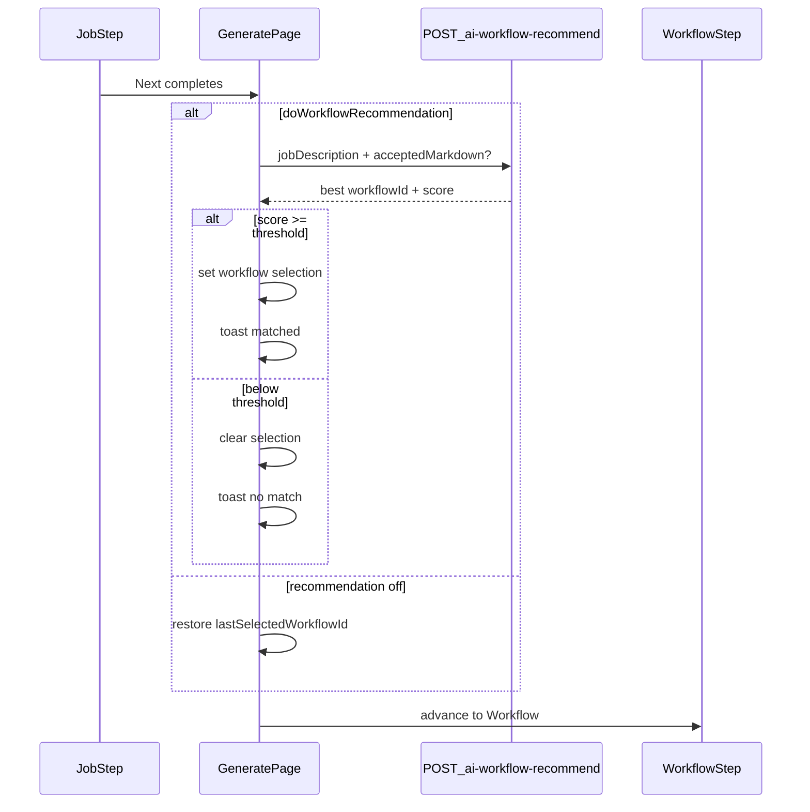

# Phase 36 — Remove Prompt Optimization, add AI Workflow Recommendation

## Summary

- **Remove** Prompt Optimization (Phase 29 feature): Settings section, `GET/PUT /settings/prompt-optimization`, `usePromptOptimizationAi`, `promptOptimizations` table, LLM rewrite path, and all Generate cache-key references to the flag.
- **Add** **Do Workflow Recommendation** + **Recommendation threshold** to Settings **Process** (same form as Do Verdict / Do Evaluate).
- **Generate flow:** On Job → Workflow transition, if recommendation is on, call a new AI endpoint using noise-filtered Job Description (+ Verdict markdown when available). Auto-select the top workflow only when its score ≥ threshold; otherwise clear selection and toast. If recommendation is off, pre-select the user’s last manually chosen workflow.

---

## Product spec ([`docs/specification.md`](docs/specification.md))

### Remove

- Settings **Prompt Optimization** section and bullet in Generate/Settings UI spec
- Phase 29 remains in history but document **Phase 36** outcome removing it

### Add — Settings / Process

- **Do Workflow Recommendation** checkbox (persist per user)
- **Recommendation threshold** numeric field (0–100, integer); shown/required when recommendation is enabled; Save validates inline (Save stays enabled)
- Saving Process settings toasts API result; changing Process flags (including new ones) resets in-progress Generate session (existing behavior for Do Verdict / Do Evaluate)

### Add — Generate



- **Recommendation ON:** runs after Job **Next** (whether or not Do Verdict ran). Uses noise-filtered JD; includes accepted Verdict markdown when present. Picks the single best workflow if score ≥ threshold; otherwise leaves nothing selected and shows a toast (not inline field error).
- **Recommendation OFF:** no AI call; restores **last manually selected** workflow from persisted user setting (if that workflow still exists).
- User may still override selection on the Workflow step table.
- Manual row click updates `lastSelectedWorkflowId` (for reuse when recommendation is off).
- Fullscreen loading while recommendation runs (same pattern as Verdict / Generate).
- Recommendation result is cached in Generate session when Job + Verdict inputs unchanged (avoid re-calling AI on back/forward).

---

## Remove Prompt Optimization (technical)

| Area | Action |
|------|--------|
| [`apps/web/src/app/(app)/settings/page.tsx`](apps/web/src/app/(app)/settings/page.tsx) | Delete Prompt Optimization form; remove related state/API calls |
| [`apps/api/src/routes/settings-prompt-optimization.ts`](apps/api/src/routes/settings-prompt-optimization.ts) | Delete; unmount from [`settings.ts`](apps/api/src/routes/settings.ts) |
| [`apps/api/prisma/schema.prisma`](apps/api/prisma/schema.prisma) | Drop `PromptOptimization` model / `promptOptimizations` table; drop `usePromptOptimizationAi` from `GenerationProcess` |
| [`apps/api/src/lib/prompt-optimize/`](apps/api/src/lib/prompt-optimize/) | Keep `compile.js` (deterministic compile); remove `rewrite.js`, cache lookup, `getUsePromptOptimizationAi`, simplify `index.ts` to export compile only |
| [`apps/api/src/routes/ai-verdict.ts`](apps/api/src/routes/ai-verdict.ts), [`ai-resume.ts`](apps/api/src/routes/ai-resume.ts), [`ai-evaluate.ts`](apps/api/src/routes/ai-evaluate.ts) | Replace `optimizeInstruction` with `compileInstruction` only; remove `promptOptimize` usage recording |
| [`apps/web/src/lib/generate-session.ts`](apps/web/src/lib/generate-session.ts) | Remove `usePromptOptimizationAi` from `PromptCacheContext` and all cache key builders |
| [`apps/web/src/app/(app)/page.tsx`](apps/web/src/app/(app)/page.tsx), [`GenerateJobStep.tsx`](apps/web/src/components/generate/GenerateJobStep.tsx) | Remove prompt-optimization props/state |
| [`apps/web/src/lib/api.ts`](apps/web/src/lib/api.ts) | Remove `get/savePromptOptimizationSettings` |
| Tests | Update [`generate-session.test.ts`](apps/web/src/lib/__tests__/generate-session.test.ts) and any prompt-optimize tests |
| [`docs/technology.md`](docs/technology.md) | Remove Prompt Optimization sections/endpoints |

---

## Add Workflow Recommendation (technical)

### Database — extend `generationProcess`

Add to [`GenerationProcess`](apps/api/prisma/schema.prisma):

- `doWorkflowRecommendation Boolean @default(false)`
- `workflowRecommendationThreshold Int @default(70)` — validated 0–100 on write
- `lastSelectedWorkflowId String?` — FK optional to `workflows.id` (SetNull on delete)

Migration drops `promptOptimizations` and `usePromptOptimizationAi`; adds new columns.

### API — Process settings ([`settings-process.ts`](apps/api/src/routes/settings-process.ts))

Extend `GET/PUT /settings/process`:

```ts
{
  doVerdict: boolean;
  doEvaluate: boolean;
  doWorkflowRecommendation: boolean;
  workflowRecommendationThreshold: number; // 0–100
  lastSelectedWorkflowId: string | null;   // read-only on GET; updated via separate path or PUT when user selects
}
```

- PUT validates threshold when `doWorkflowRecommendation` is true (or always validate range 0–100).
- Add `PUT /settings/process/last-workflow` (or include in a lightweight PATCH) to persist manual selection from Generate without re-saving all Process checkboxes.

### API — AI recommendation (new)

- `POST /ai-workflow-recommend` — body `{ jobDescription, acceptedMarkdown? }`
- Server loads user’s workflows (with assembled summary: name, description, language, profile name, company entries with period + experience categories)
- AI returns structured JSON, e.g. `{ matches: [{ workflowId, score }] }` where `score` is 0–100
- Server picks highest score; returns `{ workflowId: string | null, score: number | null, threshold }`
- Records `aiUsage` with `generateType: "workflowRecommend"`
- Uses saved Settings provider + API key (same gate as other AI routes)

New module: `apps/api/src/lib/ai-workflow-recommend/` (types, prompts, provider adapters mirroring existing AI route patterns).

Register route in [`apps/api/src/index.ts`](apps/api/src/index.ts).

### Frontend — Generate ([`page.tsx`](apps/web/src/app/(app)/page.tsx))

Replace `onAdvanceToWorkflow={() => goToStep("Workflow")}` with async handler:

1. If `doWorkflowRecommendation`: check session cache key (`jobText` + `acceptedMarkdown` + threshold + workflow list version); on miss, call `POST /ai-workflow-recommend` with loading overlay; apply result + toast.
2. Else: load `lastSelectedWorkflowId` from process settings and set workflow selection if still valid.
3. `goToStep("Workflow")`.

[`GenerateWorkflowStep.tsx`](apps/web/src/components/generate/GenerateWorkflowStep.tsx): on manual row select, call API to persist `lastSelectedWorkflowId`.

### Frontend — Settings

Extend Process form in [`settings/page.tsx`](apps/web/src/app/(app)/settings/page.tsx):

- Checkbox: **Do Workflow Recommendation**
- Number input: **Recommendation threshold** (0–100) with label/helper text; inline error if out of range on Save
- Extend `saveGenerationProcess` in [`api.ts`](apps/web/src/lib/api.ts)
- Process save clears Generate session when any Process flag/threshold changes (extend existing `processChanged` check)

### Session cache ([`generate-session.ts`](apps/web/src/lib/generate-session.ts))

Add optional fields:

- `workflowRecommendInputKey: string | null`
- (reuse existing `workflow` selection; invalidate recommend key when job/verdict/threshold changes)

Remove all `usePromptOptimizationAi` references from cache keys.

---

## Tests

- API: `POST /ai-workflow-recommend` validation; threshold pick logic (unit test scorer/parser without live LLM)
- API: Process settings read/write with new fields + threshold bounds
- Web: `buildWorkflowRecommendInputKey` / cache reuse; Process form validation
- Update existing generate-session tests after prompt-optimization removal

---

## Documentation

1. [`docs/specification.md`](docs/specification.md) — Phase 36 entry; update Settings Process + Generate Workflow behavior; remove Prompt Optimization bullets
2. [`docs/technology.md`](docs/technology.md) — schema, endpoints, removal note, recommendation flow
3. Archive plan: [`docs/plans/2026-09-07-phase-36-workflow-recommendation.md`](docs/plans/2026-09-07-phase-36-workflow-recommendation.md)

---

## Defaults (unless you want otherwise)

- `doWorkflowRecommendation`: **false** (opt-in; avoids extra AI tokens by default)
- `workflowRecommendationThreshold`: **70**
