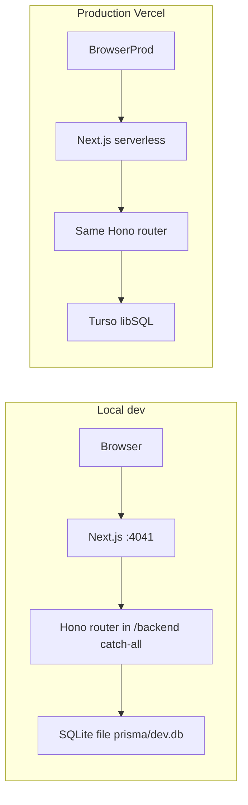
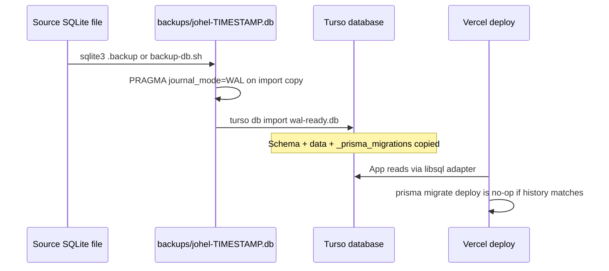

# Next.js + Turso Backend Migration Plan

## Goal

Replace the two-process architecture (Next.js `:4041` + Hono `:4042`) with a **single Next.js app** that serves both UI and API. Production database moves to **Turso**; local development keeps a **SQLite file**.

## Route strategy: Option A vs B

You chose **Option A (Hono catch-all)**. Here is how it differs from Option B:

| | **A — Hono catch-all (chosen)** | **B — Native Next.js Route Handlers** |
|---|---|---|
| **What changes** | Move `apps/api` code into `apps/web`; replace the proxy in [`apps/web/src/app/backend/[...path]/route.ts`](apps/web/src/app/backend/[...path]/route.ts) with `handle(app)` from `hono/vercel` | Rewrite ~60 endpoints across ~20 route modules into individual `route.ts` files under `app/backend/**` |
| **Effort** | Low — mostly file moves, dependency merge, adapter wiring | High — every handler must be ported from Hono `Context` to `NextRequest`/`NextResponse` |
| **Risk** | Low — same route logic, same tests (moved) | Higher — large surface area for regressions |
| **End state** | Hono remains as internal router inside Next.js | No Hono dependency; idiomatic App Router |
| **Frontend impact** | None — client still calls `/backend/*` via [`apps/web/src/lib/api.ts`](apps/web/src/lib/api.ts) | None if URLs stay `/backend/*` |

Option A is the right first step for this codebase size (~150 server lib files, long-running AI routes). Option B can be a later cleanup phase if desired.

## Target architecture



**Removed:** `apps/api` process, `API_ORIGIN` proxy, Docker dual-process entrypoint for production.

---

## Phase 1 — Move server code into `apps/web`

### 1.1 Create server directory layout

Move (preserve structure):

- [`apps/api/src/lib/**`](apps/api/src/lib/) → `apps/web/src/server/lib/**`
- [`apps/api/src/routes/**`](apps/api/src/routes/) → `apps/web/src/server/routes/**`
- [`apps/api/src/app.ts`](apps/api/src/app.ts) → `apps/web/src/server/app.ts`

Update all imports from `../lib/...` / `hono/cookie` paths as needed; keep `.js` extension style consistent with existing API code or normalize to extensionless imports matching web TS config.

### 1.2 Merge dependencies

Add to [`apps/web/package.json`](apps/web/package.json) from [`apps/api/package.json`](apps/api/package.json):

- Runtime: `hono`, `@prisma/client`, `bcryptjs`, `jose`, `openai`, `zod`
- Turso: `@libsql/client`, `@prisma/adapter-libsql`
- Dev: `prisma`, `@types/bcryptjs`, `tsx` (for scripts)

Remove `@hono/node-server` (no standalone server).

### 1.3 Move Prisma

- [`apps/api/prisma/`](apps/api/prisma/) → `apps/web/prisma/`
- Update root scripts in [`package.json`](package.json):
  - `db:migrate` → `pnpm --filter web exec prisma migrate dev`
- Update backup/restore scripts ([`scripts/backup-db.sh`](scripts/backup-db.sh), [`scripts/restore-db.sh`](scripts/restore-db.sh)) to point at `apps/web/prisma/dev.db`

[`schema.prisma`](apps/api/prisma/schema.prisma) stays `provider = "sqlite"` (Turso is SQLite-compatible via libSQL).

---

## Phase 2 — Database: SQLite dev + Turso prod

### 2.1 Prisma client factory

Replace plain [`apps/api/src/lib/prisma.ts`](apps/api/src/lib/prisma.ts) with a factory in `apps/web/src/server/lib/prisma.ts`:

```typescript
// Pseudocode — branch on env
if (isTurso(process.env.DATABASE_URL)) {
  const client = createClient({ url, authToken: process.env.TURSO_AUTH_TOKEN });
  return new PrismaClient({ adapter: new PrismaLibSQL(client) });
}
return new PrismaClient(); // file:./prisma/dev.db in dev
```

**Detection rule:** Turso when `DATABASE_URL` starts with `libsql://` (or when `TURSO_AUTH_TOKEN` is set).

### 2.2 Environment variables

| Variable | Development | Production (Vercel) |
|---|---|---|
| `DATABASE_URL` | `file:./prisma/dev.db` | `libsql://<db-name>-<org>.turso.io` |
| `TURSO_AUTH_TOKEN` | unset | Turso DB auth token |
| `JWT_SECRET` | dev default OK | strong secret (required) |
| `ENCRYPTION_KEY` | optional locally | required |
| `PUBLIC_DEPLOY` | unset | `"true"` |
| `TRUST_PROXY` | unset | `"true"` (Vercel sets forwarded headers) |

Add [`apps/web/.env.example`](apps/web/.env.example) (consolidate from [`apps/api/.env.example`](apps/api/.env.example)). Deprecate `apps/api/.env.example`.

### 2.3 Migrations on Vercel

Add to web `package.json`:

```json
"build": "prisma generate && prisma migrate deploy && next build"
```

Or split: `postinstall: prisma generate`, `build: prisma migrate deploy && next build`.

Ensure Prisma CLI runs in CI ([`.github/workflows/ci.yml`](.github/workflows/ci.yml)) against web package.

### 2.4 Existing data migration (SQLite → Turso)

This is a **one-time cutover** from an on-disk SQLite file to Turso. It has two separate concerns: **schema** (Prisma migrations) and **rows** (users, profiles, generations, embeddings, etc.).

#### Where production data lives today

| Source | Path | When to use |
| --- | --- | --- |
| Local dev | `apps/api/prisma/dev.db` (→ `apps/web/prisma/dev.db` after move) | You only ever used `pnpm dev` |
| Docker prod/LAN | `/data/johel.db` on volume `johel-data` | Real multi-user data in Docker |
| Backup files | `./backups/johel-*.db` via [`scripts/backup-db.sh`](scripts/backup-db.sh) | Safest starting point before any cutover |

Always take a fresh backup before cutover (`scripts/backup-db.sh`).

#### Recommended approach: **Turso `db import` (whole SQLite file)**

Turso can ingest a **consistent SQLite database file** in one step. This preserves all tables, indexes, and **`_prisma_migrations`** history so Prisma knows migrations are already applied.



**Steps:**

1. **Freeze writes** — stop Docker (`docker compose stop`) or ensure no one is using the instance you are copying.
2. **Export a consistent snapshot** (pick one):
   - From host: `scripts/backup-db.sh` → `./backups/johel-YYYYMMDD-HHMMSS.db`
   - From Docker volume: same script (uses `sqlite3 .backup` inside container when running)
   - Manual: `sqlite3 /path/to/source.db ".backup '/path/to/snapshot.db'"`
   - Do **not** copy a live `.db` with plain `cp` while the app is writing (risk of corruption).
3. **Prepare snapshot for Turso (WAL required)** — see [Fix: `journal_mode=WAL`](#fix-journal_modewal-for-turso-db-import) below. JoHEL snapshots from Prisma/SQLite default are often **`delete`**, which causes Turso to reject import with *"upload works only for DBs with journal_mode=WAL"*.
4. **Create Turso DB** (CLI or dashboard): `turso db create johel-prod` (name as you prefer).
5. **Import WAL-ready file:** `turso db import johel-prod ./backups/johel-....-wal.db`
6. **Create token:** `turso db tokens create johel-prod` → set `TURSO_AUTH_TOKEN` on Vercel.
7. **Set `DATABASE_URL`** on Vercel to the `libsql://…` URL from `turso db show johel-prod --url`.
8. **Deploy app** with `prisma migrate deploy` in build — should apply **zero** new migrations if import included `_prisma_migrations` and matches repo migration history.
9. **Verify:** login with existing user, open a generation, check settings (encrypted API key still decrypts — see secrets below).

#### Fix: `journal_mode=WAL` for Turso `db import`

Turso **`turso db import`** only accepts SQLite files whose **`journal_mode` is `wal`**. Prisma’s default SQLite file and JoHEL’s Docker DB typically use **`delete`** (rollback journal), so import fails until the **import copy** is converted.

**Check** (on the snapshot you plan to upload):

```bash
sqlite3 ./backups/johel-TIMESTAMP.db "PRAGMA journal_mode;"
# delete  → must fix before import
# wal     → OK for turso db import
```

**Fix** (always on a **copy**; keep the original backup unchanged):

```bash
SRC=./backups/johel-TIMESTAMP.db
WAL_READY=./backups/johel-TIMESTAMP-wal.db

cp "$SRC" "$WAL_READY"
sqlite3 "$WAL_READY" "PRAGMA journal_mode=WAL;"
sqlite3 "$WAL_READY" "PRAGMA wal_checkpoint(FULL);"
sqlite3 "$WAL_READY" "PRAGMA journal_mode;"   # must print: wal

turso db import johel-prod "$WAL_READY"
```

Notes:

- Run WAL conversion **after** the consistent `.backup` snapshot, **before** `turso db import`.
- WAL mode on the converted copy does **not** change row data; it only satisfies Turso’s upload requirement.
- Optional `-wal` / `-shm` sidecar files may appear next to `$WAL_READY` locally; upload the **main `.db` file** Turso expects (same as CLI docs for your Turso version).
- If import still fails, rebuild a clean file then convert: `sqlite3 "$SRC" ".backup '$WAL_READY'"` then run the two `PRAGMA` lines again on `$WAL_READY`.

**Repo follow-up (implementation phase):** add [`scripts/prepare-sqlite-for-turso-import.sh`](scripts/prepare-sqlite-for-turso-import.sh) (input backup path → WAL-ready path + verification) and mention it in [`docs/technology.md`](docs/technology.md) beside the Turso cutover steps. Optionally document the same one-liner in [`scripts/backup-db.sh`](scripts/backup-db.sh) comments so operators see it after backup.

#### Alternative: **empty Turso + Prisma migrate + data-only import**

Use when you want a clean schema from migrations only (e.g. import file schema is stale):

1. Point `DATABASE_URL` + `TURSO_AUTH_TOKEN` at a **new empty** Turso DB locally.
2. Run `pnpm --filter web exec prisma migrate deploy` (creates empty tables + `_prisma_migrations`).
3. Export **data only** from source SQLite (exclude DDL and `_prisma_migrations`), e.g. filter `sqlite3 .dump` to `INSERT` statements for app tables only, or use a small script with Prisma/`sqlite3` per table.
4. Load into Turso via `turso db shell` or libsql CLI.

This is more error-prone (FK order, BLOB columns for embeddings). Prefer **whole-file `db import`** when the source DB is already on the same Prisma migration history as the repo.

#### What must **not** be lost (secrets)

| Secret | Why it matters for migrated data |
| --- | --- |
| `ENCRYPTION_KEY` | User `settings.apiKey` values are AES-encrypted at rest. **Same key** must be set on Vercel or keys decrypt as garbage and AI calls fail. |
| `JWT_SECRET` | If unchanged, existing sessions may still work briefly; if changed, all users must log in again (`sessionVersion` still valid in DB). |

Copy `JWT_SECRET` and `ENCRYPTION_KEY` from the environment that **wrote** the SQLite file (Docker `.env` / compose env), not only the DB file.

#### Post-import app maintenance

- Run **`migratePlaintextApiKeys`** once against Turso if any rows still store plaintext API keys (today this runs at API boot in [`apps/api/src/index.ts`](apps/api/src/index.ts); on Vercel use a one-off script after import).
- **Do not** run `prisma migrate reset` on Turso production.
- Keep the backup `.db` until Vercel smoke tests pass.

#### Staging dry run

1. Create `johel-staging` Turso DB.
2. Import the same snapshot.
3. Point a Vercel **preview** deployment at staging env vars.
4. Run verification checklist (auth, one CRUD, one AI call with stored key).

Document operator steps in [`docs/technology.md`](docs/technology.md) when the phase is implemented (not in `specification.md`).

---

## Phase 3 — Wire Hono into Next.js catch-all

### 3.1 Replace proxy route

Rewrite [`apps/web/src/app/backend/[...path]/route.ts`](apps/web/src/app/backend/[...path]/route.ts):

```typescript
import { handle } from "hono/vercel";
import { createApp } from "@/server/app";

const app = createApp();
const honoHandler = handle(app);

// Export GET/POST/PUT/PATCH/DELETE/OPTIONS
```

**Path prefix:** Requests arrive as `/backend/auth/login` but Hono routes are mounted at `/auth`. Add a thin wrapper that rewrites `request.url` pathname from `/backend/...` → `/...` before calling `honoHandler`, **or** set `app.basePath("/backend")` in `createApp()` when running inside Next.js.

Keep [`apps/web/src/lib/api.ts`](apps/web/src/lib/api.ts) unchanged (`/backend` prefix, `credentials: "include"`).

### 3.2 Runtime and timeouts

AI/resume routes use **300s** timeout ([`apps/web/src/lib/api-timeout.ts`](apps/web/src/lib/api-timeout.ts)). On Vercel:

- Set `export const runtime = "nodejs"` on the catch-all route (required for Prisma, bcrypt, long requests).
- Set `export const maxDuration = 300` (requires Vercel Pro plan for >60s).
- Add matching config in `vercel.json` if needed.

### 3.3 Remove CORS middleware (optional cleanup)

Same-origin `/backend/*` no longer needs cross-origin CORS. The current CORS block in [`apps/api/src/app.ts`](apps/api/src/app.ts) can be removed or narrowed to a no-op once proxy is gone.

### 3.4 Startup side effects

[`apps/api/src/index.ts`](apps/api/src/index.ts) runs `migratePlaintextApiKeys()` at boot. On serverless there is no persistent boot:

- Move to a **one-off script** (`pnpm db:migrate-keys`) run during deploy/migration, **or**
- Invoke lazily on first settings read (idempotent).

Do **not** rely on `index.ts` startup in Vercel.

### 3.5 Rate limiting caveat

Current in-memory rate limiter ([`apps/api/src/lib/rate-limit.ts`](apps/api/src/lib/rate-limit.ts)) works per instance only. On Vercel multi-instance/serverless, limits are best-effort. Document this in `technology.md`; defer Redis/Upstash unless required later.

---

## Phase 4 — Dev workflow and test migration

### 4.1 Local development

- **Single command:** `pnpm dev:web` only (remove `dev:api` from root [`package.json`](package.json)).
- Dev env file: `apps/web/.env` with `DATABASE_URL="file:./prisma/dev.db"`.
- First-time: `pnpm db:migrate` then `pnpm dev:web`.

Update [`README.md`](README.md) accordingly.

### 4.2 Move tests

- Move [`apps/api/src/**/__tests__/**`](apps/api/src/) and route tests to `apps/web/src/server/**` (or co-located).
- Update [`apps/web/vitest.config.mts`](apps/web/vitest.config.mts) to include server tests.
- Root `pnpm test` → web tests only (or web + existing web lib tests).
- Integration tests that set `process.env.DATABASE_URL = file:...` continue to work with temp DB + `prisma migrate deploy`.

### 4.3 CI

Update [`.github/workflows/ci.yml`](.github/workflows/ci.yml):

- `pnpm --filter web exec prisma generate`
- `pnpm --filter web test`
- `pnpm --filter web build` with test `DATABASE_URL=file:./prisma/test.db` if needed

---

## Phase 5 — Vercel production deployment

### 5.1 Vercel project settings

- **Root directory:** repo root (or `apps/web` if using monorepo preset — configure install/build for pnpm workspace).
- **Build command:** `pnpm --filter web build` (includes migrate deploy).
- **Install:** `pnpm install --frozen-lockfile`
- **Env vars:** `DATABASE_URL`, `TURSO_AUTH_TOKEN`, `JWT_SECRET`, `ENCRYPTION_KEY`, `PUBLIC_DEPLOY=true`, `TRUST_PROXY=true`, `PUBLIC_URL=https://<domain>`

### 5.2 `vercel.json` (new, repo root or `apps/web`)

- Configure `maxDuration` for `/backend/*` if not set in route segment.
- Ensure no rewrite that conflicts with `/backend/[...path]`.

### 5.3 Docker (optional / legacy)

Current [`Dockerfile`](Dockerfile) and [`docker-entrypoint.sh`](docker-entrypoint.sh) start API + Next. Options:

- **A (recommended):** Mark Docker as legacy LAN-only dev preview; production = Vercel + Turso.
- **B:** Simplify Docker to single Next process + Turso env (no local volume DB).

Update [`docs/docker.md`](docs/docker.md) to reflect Vercel as primary production path.

---

## Phase 6 — Remove `apps/api` and update docs

### 6.1 Delete deprecated package

After all tests pass:

- Remove `apps/api/` entirely
- Remove from [`pnpm-workspace.yaml`](pnpm-workspace.yaml) if listed explicitly
- Remove `dev:api`, `pnpm --filter api` references across repo

### 6.2 Documentation (per governance rules)

- [`docs/specification.md`](docs/specification.md): add new Phase (e.g. **Phase 93 — Next.js monolith + Turso**), mark complete when done
- [`docs/technology.md`](docs/technology.md): update architecture diagram, database section (Turso prod / SQLite dev), remove Hono standalone process, document Vercel deploy + env vars
- Archive this plan to `docs/plans/2026-09-22-phase-93-nextjs-turso-migration.md`

---

## Key files touched (summary)

| Action | Path |
|---|---|
| Replace proxy | [`apps/web/src/app/backend/[...path]/route.ts`](apps/web/src/app/backend/[...path]/route.ts) |
| Move server | `apps/api/src/**` → `apps/web/src/server/**` |
| Move DB | `apps/api/prisma/**` → `apps/web/prisma/**` |
| Prisma adapter | `apps/web/src/server/lib/prisma.ts` (new factory) |
| Merge deps | [`apps/web/package.json`](apps/web/package.json) |
| Root scripts | [`package.json`](package.json) |
| CI | [`.github/workflows/ci.yml`](.github/workflows/ci.yml) |
| Vercel | `vercel.json` (new) |
| Remove | `apps/api/` (final step) |

---

## Verification checklist

1. Local: register/login, CRUD profiles/companies/experiences, one AI call, resume PDF export — all via `/backend/*` on `:4041` only.
2. Tests: all migrated Vitest suites green in CI.
3. Turso staging: `prisma migrate deploy`, auth + generation smoke test on Vercel preview.
4. Cookie auth: `johel_session` still httpOnly on UI origin; no CORS regressions.
5. Long AI routes complete within configured `maxDuration`.
6. Existing frontend unchanged except env/docs.

---

## Risks and mitigations

| Risk | Mitigation |
|---|---|
| Vercel function timeout | `maxDuration = 300` + Pro plan; monitor slow routes |
| Serverless cold starts | Acceptable for this app; document latency |
| In-memory rate limits weak on Vercel | Document; revisit if abuse becomes an issue |
| Turso migration data loss | Document export/import; test on staging first |
| Turso import rejects non-WAL SQLite | Convert import copy with `PRAGMA journal_mode=WAL` + checkpoint; verify before `turso db import` |
| `migratePlaintextApiKeys` on serverless | Run as deploy script, not boot hook |
| Monorepo Prisma paths on Vercel | Set `prisma` schema path explicitly in package.json / build script |
