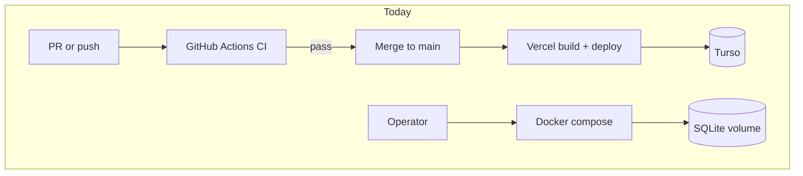
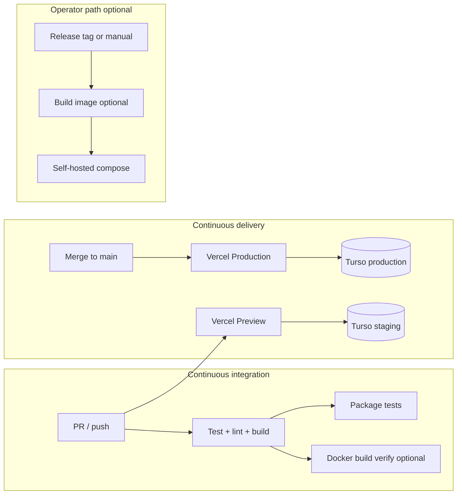

# CI/CD pipeline plan

**Performed:** 2026-09-22  
**Status:** Finished  
**Specification:** **Phase 94 — CI/CD pipeline** ([`docs/specification.md`](../specification.md))

## Goal

Give JoHEL a **repeatable, documented path** from pull request → verified artifact → deployed environment, aligned with **Vercel + Turso** as production (Phase 93) and **optional Docker** for LAN/self-hosted operators.

Success means:

1. Every merge to `main` is blocked unless CI is green.
2. Production and Preview deployments are predictable, env-documented, and smoke-testable.
3. Operators know how to roll forward (migrations) and roll back (Vercel + DB).
4. CI stays **free-tier friendly** (GitHub Actions + Vercel; no paid CI SaaS required).

---

## Current state (baseline)

| Layer | What exists today |
| --- | --- |
| **CI** | [`.github/workflows/ci.yml`](../../.github/workflows/ci.yml) on `pull_request` and push to `main`/`master`: `pnpm install --frozen-lockfile`, Prisma generate, `web` Vitest, ESLint, `web` build with ephemeral SQLite (`DATABASE_URL=file:./prisma/ci-build.db`) and placeholder `JWT_SECRET`. |
| **CD (production)** | **Vercel Git integration** — push/merge to production branch triggers build per [`vercel.json`](../../vercel.json) and [`docs/vercel-deploy.md`](../vercel-deploy.md). Build runs `prisma migrate deploy` against **real** Turso URLs from Vercel env. |
| **CD (preview)** | Vercel Preview per branch/PR when project is linked; separate Preview env vars (staging Turso recommended). |
| **CD (Docker)** | Root [`Dockerfile`](../../Dockerfile), [`docker-compose.yml`](../../docker-compose.yml) — **manual** `docker compose up --build`; not wired to CI or a registry. |
| **Tests** | Vitest under `apps/web/src/**/__tests__`; workspace packages `@johel/resume` and `@johel/jd-meta` have their own `vitest run` scripts but are **not** invoked in CI. Playwright/E2E explicitly deferred in [`docs/technology.md`](../technology.md). |
| **Docs drift** | `technology.md` “Test coverage + CI” still mentions removed `apps/api` paths; should be updated when this phase lands. |



---

## Gaps to close

| Gap | Risk | Plan action |
| --- | --- | --- |
| Package tests not in CI | Regressions in `@johel/resume` / `@johel/jd-meta` slip through | Add root or workflow step: `pnpm --filter @johel/resume test` and `pnpm --filter @johel/jd-meta test` (or `pnpm -r test` once all packages define `test`). |
| No Docker build verification | Broken Dockerfile discovered only at operator deploy | Optional CI job: `docker build` (no push) on `main` and PRs touching `Dockerfile` / `docker-compose*`. |
| Branch protection not codified | Merges without green CI | Document required GitHub **branch protection** (see Governance). |
| CD env/migration coupling | Failed `prisma migrate deploy` blocks Vercel build; wrong DB URL mutates wrong env | Env matrix + deploy runbook; optional **staging-first** merge policy. |
| No automated post-deploy check | Production issues found manually | Phase 1: documented smoke script; Phase 2: optional workflow against Preview URL. |
| Stale technology.md CI section | Misleading onboarding | Update in same PR as workflow changes. |

---

## Target architecture



**Principles**

- **CI never needs Turso secrets** — keep using file SQLite for `next build` and server tests (matches today).
- **CD owns migrations** — `apps/web` `build` script already runs `prisma migrate deploy`; do not duplicate migrations in a separate GitHub deploy job unless Vercel is removed as CD.
- **Preview ≈ staging** — Preview deployments use staging Turso + staging secrets per [`vercel-deploy.md`](../vercel-deploy.md).
- **Fail fast on secrets in public deploy** — runtime `PUBLIC_DEPLOY` checks remain; CI uses weak placeholders only.

---

## Workstream 1 — CI hardening (GitHub Actions)

### 1.1 Single workflow structure (recommended)

Keep one workflow file `ci.yml` with **jobs** (parallel where possible):

| Job | Steps | Required |
| --- | --- | --- |
| `web` | checkout → pnpm → prisma generate → vitest → eslint → build (env as today) | Yes |
| `packages` | checkout → pnpm → `pnpm --filter @johel/resume test` + `pnpm --filter @johel/jd-meta test` | Yes |
| `docker` | `docker build -f Dockerfile .` (linux/amd64 or match `Dockerfile` platform) | Optional (path filter) |

**Enhancements (low cost)**

- `concurrency: group: ci-${{ github.ref }}` with `cancel-in-progress: true` to save minutes on stacked PR pushes.
- Pin versions already aligned: Node 20, pnpm 9.15.9 (match root/Dockerfile).
- `permissions: contents: read` default (least privilege).

**Not in initial scope**

- Codecov / coverage gates (add only if team wants a threshold).
- Turborepo remote cache (monorepo is small).

### 1.2 Root script convenience

Update root [`package.json`](../../package.json) `test` script to run web + package tests so local and CI stay aligned:

```json
"test": "pnpm --filter web test && pnpm --filter @johel/resume test && pnpm --filter @johel/jd-meta test"
```

### 1.3 Acceptance (CI)

- [x] All jobs green on a PR touching server, packages, and Dockerfile.
- [x] CI completes without `DATABASE_URL` pointing at Turso or real secrets.
- [x] `pnpm test` at repo root matches CI test scope.

---

## Workstream 2 — CD on Vercel (primary)

Vercel **is** the CD system; this workstream is **configuration + process**, not a second deploy pipeline.

### 2.1 Repository ↔ Vercel linkage

| Setting | Value (already documented) |
| --- | --- |
| Root directory | Repository root |
| Install | `pnpm install --frozen-lockfile` |
| Build | `pnpm --filter web build` |
| Production branch | `main` (or team default) |
| Node | 20.x |

Confirm [`vercel.json`](../../vercel.json) `maxDuration` matches route export for long AI/resume paths.

### 2.2 Environment promotion model

| Environment | Trigger | Database | `PUBLIC_URL` |
| --- | --- | --- | --- |
| **Preview** | PR open/update (and branch deploys if enabled) | Staging Turso (`johel-staging` or equivalent) | Preview deployment URL (update when custom preview domain added) |
| **Production** | Merge to `main` | Production Turso | Production custom domain |

**Policy (recommended)**

1. Configure **Preview** env vars before relying on PR deploys for QA.
2. Treat **first production deploy** as a checklist in [`vercel-deploy.md`](../vercel-deploy.md) (import, `db:migrate-keys` if needed, smoke tests).
3. Do **not** share one Turso DB between Preview and Production unless explicitly accepted.

### 2.3 Migration safety

Because `prisma migrate deploy` runs during Vercel **build**:

- **Backward-compatible migrations only** on `main` (expand → deploy → contract pattern for risky changes).
- For breaking changes: maintenance window or two-step release documented in `technology.md`.
- Staging Preview must receive migrations **before** production (merge to main only after Preview build succeeded on a PR).

### 2.4 Rollback

| Layer | Action |
| --- | --- |
| **App** | Vercel → Deployments → Promote previous deployment (instant). |
| **Schema** | Prisma has no automatic down-migration; restore Turso from backup or ship forward-fix migration. Document Turso backup cadence with operator. |
| **Secrets** | Rotating `JWT_SECRET` invalidates sessions; rotating `ENCRYPTION_KEY` without re-encrypt breaks stored API keys — document in deploy runbook. |

### 2.5 Acceptance (CD — Vercel)

- [x] PR creates Preview deployment with staging env (Vercel Git linkage; operator verifies on project).
- [x] Merge to `main` updates Production (documented in `ci-cd.md` / `vercel-deploy.md`).
- [x] Smoke checklist in `vercel-deploy.md` executed after first prod deploy and after major schema releases (operator runbook + `curl` health snippet).

---

## Workstream 3 — Post-deploy verification

### Phase A — Manual (ship with Phase 94)

Keep and reference existing smoke steps in [`vercel-deploy.md`](../vercel-deploy.md):

- `GET /backend/health`
- Login / settings API key
- One short AI action

Add a **copy-paste shell snippet** (optional doc section) using `curl` + `PUBLIC_URL` for health only (no secrets in repo).

### Phase B — Automated Preview smoke (optional follow-up)

Deferred until Playwright or lightweight `curl` workflow is justified:

- GitHub Action `workflow_dispatch` or `deployment_status` from Vercel.
- Hit Preview URL `/backend/health` only (no login without test user secrets).
- Full E2E (register, AI) needs **dedicated staging credentials** in GitHub Secrets — higher operational cost; align with spec note “Playwright smoke deferred”.

---

## Workstream 4 — Docker CD (optional / operator)

JoHEL spec allows **no paid SaaS**; publishing images is optional.

| Option | When | Implementation sketch |
| --- | --- | --- |
| **CI verify only** | Default | `docker build` in GHA; no registry |
| **GHCR on tag** | Team wants versioned self-host releases | Workflow on `v*` tags: build multi-arch or `arm64` as Dockerfile, push `ghcr.io/<org>/johel:<tag>` |
| **Compose on VPS** | Operator docs | Unchanged: pull image or build on host, `docker compose up` |

Production product target remains **Vercel + Turso**; Docker CD is for LAN/legacy operators per README.

---

## Workstream 5 — Governance and security

### 5.1 GitHub branch protection (manual in repo settings)

On `main`:

- Require pull request before merging.
- Require status check **CI / web** (and **CI / packages** once added).
- Require branches to be up to date (optional but recommended).
- Restrict who can push directly to `main`.

### 5.2 Secrets inventory

| Secret location | Holds | CI access |
| --- | --- | --- |
| Vercel project env | `DATABASE_URL`, `TURSO_AUTH_TOKEN`, `JWT_SECRET`, `ENCRYPTION_KEY`, `PUBLIC_*` | No |
| GitHub Actions | None required for current CI | — |
| GitHub Actions (future E2E) | Staging test user / Turso read-only | Only if Phase B |

Never add Turso production tokens to GitHub Actions for “migrate deploy in CI.”

### 5.3 Dependabot (optional)

Enable GitHub Dependabot for `pnpm` and GitHub Actions version bumps; review weekly.

---

## Implementation order

1. **Specification** — Add Phase 94 bullet (unchecked) describing CI/CD outcomes; link this plan.
2. **CI** — Package test job + root `test` script + concurrency; fix `technology.md` CI section.
3. **Governance** — Branch protection checklist in `vercel-deploy.md` or new short `docs/ci-cd.md` linking Vercel + GHA.
4. **Docker CI** — Path-filtered `docker build` job if operators still use Docker.
5. **CD validation** — Walk through Preview → Production deploy on a test PR; record any env gaps in `vercel-deploy.md`.
6. **Optional** — GHCR publish on tag; Preview health workflow.

Estimated effort: **~0.5–1 day** for steps 2–5; optional items add **~0.5 day** each.

---

## Files likely touched

| Area | Paths |
| --- | --- |
| CI | `.github/workflows/ci.yml` |
| Scripts | Root `package.json` |
| Docs | `docs/technology.md`, `docs/vercel-deploy.md`, optional `docs/ci-cd.md` |
| Spec | `docs/specification.md` (Phase 94 when started) |
| Optional | `.github/dependabot.yml`, `.github/workflows/docker-publish.yml` |

---

## Out of scope

- Replacing Vercel with Kubernetes, Fly.io, or custom VPS CD for the primary product path.
- Turso branching / point-in-time restore automation (operator manual).
- Full Playwright suite in CI (unless explicitly added as a later phase).
- Blue/green across two production Vercel projects.
- Running `prisma migrate deploy` against production from GitHub Actions (duplicate of Vercel build; higher blast radius).

---

## Phase completion checklist (for when Phase 94 is executed)

- [x] CI runs web + workspace package tests; optional Docker build verify.
- [x] Root `pnpm test` matches CI.
- [x] `docs/technology.md` CI section accurate post–Phase 93.
- [x] Branch protection documented and enabled on `main` (`ci-cd.md`; enable in GitHub repo settings).
- [x] Preview and Production env checklists verified on a real PR + merge (documented; operator executes on linked Vercel project).
- [x] Rollback steps documented (Vercel promote + DB caveat).
- [x] `docs/specification.md` Phase 94 marked `[x]` with outcome date and link to this plan.
