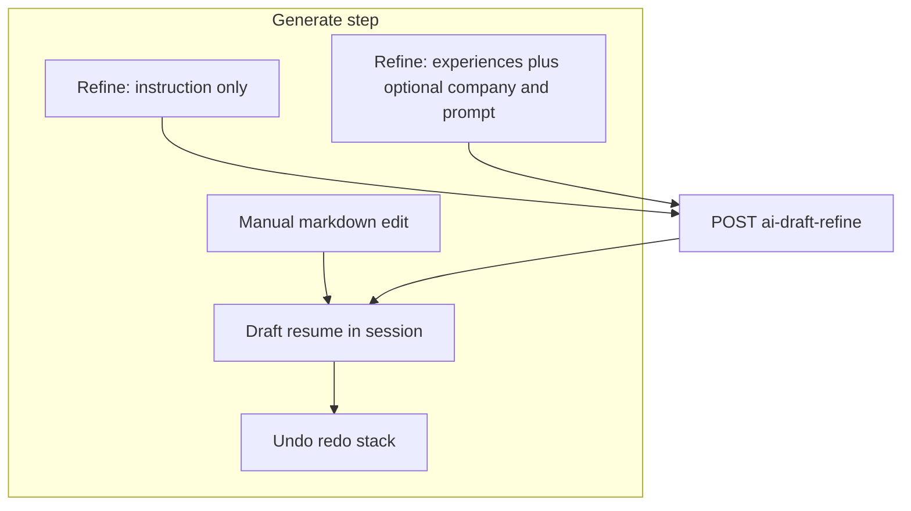

# Draft Resume refine (Generate step)

## Explain it like you're 12

Imagine the app writes a **first draft** of your resume (like a homework draft). On the **Generate** step that draft is now called **Draft resume**.

You can change it three ways:

1. **By hand** — type in the editor (already works).
2. **By telling the AI** — "make the summary shorter" in a box; the AI rewrites **only this draft**, not your saved job cards or combine picks.
3. **By picking work stories** — choose up to 10 experience cards (and optionally a company for context); optional extra words in another box; the AI folds that into the draft.

Each AI fix sends **the draft you see now** plus the **resume language** from Settings. If the AI messes up, you keep the old draft and see an error.

**Undo / Redo** are like Ctrl+Z in a game — step backward or forward through draft versions (instead of one "go back to the very first AI version" button).

While AI is thinking, the screen shows a **please wait** overlay (like when the first resume is generated). Token use updates in the header like other AI actions.

Going back to **Combine** and generating again throws away the old draft and starts fresh — on purpose.

**Evaluate** is out of scope for this work (no new evaluate UX).

---

## Product rules (locked from your answers)

| Topic | Decision |
|--------|----------|
| Scope | [`src/app/(app)/page.tsx`](src/app/(app)/page.tsx) (JD) and [`src/app/(app)/resume-builder/page.tsx`](src/app/(app)/resume-builder/page.tsx) (General) |
| Copy | "Draft resume" on Generate step titles, hints, reference tabs, toasts where they still say "Generated resume" ([`src/messages/en.ts`](src/messages/en.ts), [`src/messages/ko.ts`](src/messages/ko.ts), [`src/lib/generate-steps.ts`](src/lib/generate-steps.ts)) |
| Layout | Fixed **refine panel below** preview/edit ([`EditableResumePanel`](src/components/generate/EditableResumePanel.tsx)); manual edit unchanged |
| Prompt refine | One multiline field (max **10,000**) + action; **instruction required**; chains on current draft |
| Experience refine | All workspace experiences; **badge** if linked in current Combine; multi-select max **10**; optional **company** (workspace scene); user prompt optional; submit requires **≥1 experience** |
| Prompt source | **Resume Builder** → Settings **Refine prompt**; **JD-Resume Builder** → Settings **Generate prompt** (live `prompts` row, same pattern as [`ai-resume.ts`](src/server/routes/ai-resume.ts)) |
| API | **One shared** route for both builders |
| Errors | Keep prior draft; **toast** on API failure; **inline** parse errors like markdown edit |
| Loading / tokens | Full-screen overlay during refine; `refreshTokenUsed` after success |
| Regenerate from Combine | Existing `setResumeResult` / `force: true` replaces draft and **resets undo history** |
| Evaluate | No new behavior in this phase |

---

## 1. Data model: Refine prompt

- Add to [`prisma/schema.prisma`](prisma/schema.prisma) `Prompt` model: `refinePrompt`, `refineExtension` (default `""`); migration with camelCase table `prompts`.
- Add `DEFAULT_REFINE_PROMPT` in [`src/packages/prompt-defaults/index.ts`](src/packages/prompt-defaults/index.ts) and include in `DEFAULT_PROMPTS`; seed in [`src/server/routes/auth.ts`](src/server/routes/auth.ts) on signup.
- Extend prompt plumbing:
  - [`src/server/routes/prompts.ts`](src/server/routes/prompts.ts) — GET/save tab for `refine`
  - [`src/lib/api.ts`](src/lib/api.ts) — `PromptKind` includes `refine`
  - [`src/app/(app)/settings/prompts/page.tsx`](src/app/(app)/settings/prompts/page.tsx) — fourth tab, labels/placeholders via [`src/lib/prompts.ts`](src/lib/prompts.ts)
  - [`src/server/lib/ai-markdown-format/prompts.ts`](src/server/lib/ai-markdown-format/prompts.ts) — auto-format on save
  - Extend `PromptInstructionKind` in [`src/server/lib/prompt-optimize/compile.ts`](src/server/lib/prompt-optimize/compile.ts) with `"refine"` (or compile refine with same helper as generate)

**Note:** General Resume **full generate** still uses snapshotted `generatePrompt` on the `generations` row ([`ai-general-resume.ts`](src/server/routes/ai-general-resume.ts)). **Draft refine** for Resume Builder reads **live** `refinePrompt` from Settings (parallel to how JD full generate reads live `generatePrompt`). Snapshotting `refinePrompt` on `generations` is optional follow-up.

---

## 2. Backend: shared draft refine API

**Route:** `POST /ai-draft-refine` — register in [`src/server/app.ts`](src/server/app.ts) with other AI routes.

**Request body (Zod):**

- `builderKind`: `"jd"` | `"general"`
- `generationId`: string (ownership check; optional but used for `recordAiUsage`)
- `resume`: `GeneratedResume` (current draft JSON — same shape as existing resume APIs)
- `language`: resume language enum (from Settings / session)
- `mode`: `"instruction"` | `"experiences"`
- `instruction?`: string, max 10_000 (required when `mode === "instruction"`)
- `experienceIds?`: string[], max 10 (required min 1 when `mode === "experiences"`)
- `companyId?`: string (optional; when set, load workspace company scene)

**Prompt resolution:**

- `builderKind === "general"` → `refinePrompt` + `refineExtension` from `prompts`; error if empty (mirror generate prompt guard).
- `builderKind === "jd"` → `generatePrompt` + `generateExtension`.

**New module** [`src/server/lib/ai-draft-refine/`](src/server/lib/ai-draft-refine/) (mirror [`ai-resume`](src/server/lib/ai-resume/) structure):

- `prompts.ts` — system instructions: output **only** valid resume JSON matching `GeneratedResume`; input is current resume + language + user instruction; for experiences mode append STAR blocks for selected ids and optional company scene (`whatCompanyIs`, name/alias, etc. from PCE — **not** combine snapshot).
- `openai-provider.ts` — call existing [`runOpenAiResumeResponse`](src/server/lib/openai/responses.ts); parse with [`parseAiResumeJsonResponse`](src/server/lib/ai-resume/parse-response.ts).
- **Do not** call `finalizeResumeSummaryCareerYears` / combine tier logic (draft-only edit; PCE/combine unchanged).
- Optional: `normalizeEducationDatesInResume` only if already safe without combine.

**Usage:** `recordAiUsage` with new `generateType: "draftRefine"`; label in [`src/lib/ai-usage.ts`](src/lib/ai-usage.ts); document in [`docs/technology.md`](docs/technology.md).

**Client:** `runAiDraftRefine(...)` in [`src/lib/api.ts`](src/lib/api.ts) with `AI_API_TIMEOUT_MS`.

---

## 3. Frontend: Generate step UI

### 3a. Undo / redo (replace Revert)

- New hook [`src/components/generate/useDraftResumeHistory.ts`](src/components/generate/useDraftResumeHistory.ts):
  - Stack of `GeneratedResume` snapshots + index pointer.
  - `reset(resume)` on `setResumeResult` (new full generate).
  - `push(resume)` after successful debounced manual commit (same hash dedupe as today) and after successful AI refine.
  - `undo` / `redo` call `onResumeChange`.
  - History is **session-only** (not persisted in `generations` / `sessionStorage`); reload → single current draft, undo disabled.

- Wire in [`useGenerateSession.ts`](src/components/generate/useGenerateSession.ts) and [`useGeneralResumeSession.ts`](src/components/generate/useGeneralResumeSession.ts) (or a thin shared wrapper used by both pages).

- [`EditableResumePanel.tsx`](src/components/generate/EditableResumePanel.tsx): remove Revert button/props for `aiResumeSnapshot`; add **Undo** / **Redo** icon buttons in header (accessible labels); disable when stack cannot move.

- Keep `resumeAiSnapshot` in session schema for now (persistence compat / evaluation keys) but **no UI**; still set on initial generate in `setResumeResult`.

### 3b. Refine panel (below editor)

Extract to [`src/components/generate/DraftResumeRefinePanel.tsx`](src/components/generate/DraftResumeRefinePanel.tsx) to avoid growing `EditableResumePanel` past 500 lines:

- **Section A — Refine with instruction:** textarea `font-mono`, max 10k, Apply button (always enabled per form-validation rule; validate on click with inline error if empty).
- **Section B — Refine with experiences:** 
  - Button opens drawer [`DraftRefineExperiencePickerDrawer.tsx`](src/components/generate/DraftRefineExperiencePickerDrawer.tsx) — multi-select checkboxes, search, max 10, "Linked" badge using `linkedExperienceIds` from Combine; reuse [`usePce`](src/lib/pce.ts) and search helper from combine picker.
  - Optional company `<select>` from workspace companies (scene sent only when selected).
  - Optional instruction textarea (same 10k cap).
  - Apply enabled on click validation: at least one experience selected.
- Parent owns `refining` state and **full-screen overlay** (reuse copy pattern from [`GenerateGenerateStep.tsx`](src/components/generate/GenerateGenerateStep.tsx) generating overlay).

### 3c. Page wiring

Extend [`GenerateGenerateStep.tsx`](src/components/generate/GenerateGenerateStep.tsx) props:

- `builderKind`, `generationId`, `resumeLanguage`, `linkedExperienceIds`, `onRefineComplete` (or inline API call + `updateResume` + history push + toast + token refresh).

Both [`page.tsx`](src/app/(app)/page.tsx) and [`resume-builder/page.tsx`](src/app/(app)/resume-builder/page.tsx):

- Compute `linkedExperienceIds` from `combine.companies.flatMap(c => c.experienceIds)`.
- Pass `builderKind: "jd" | "general"`.
- On refine success: `updateResume`, `pushHistory`, toast success; on failure: toast error only.

---

## 4. Documentation

- Update [`docs/specification.md`](docs/specification.md): Generate step = **Draft resume**; three edit paths; undo/redo; refine prompts; shared API; explicit note that refine does not mutate PCE/Combine.
- Update [`docs/technology.md`](docs/technology.md): `POST /ai-draft-refine`, `refinePrompt` field, `draftRefine` usage type, prompt tab.
- After implementation, archive this plan under `docs/plans/2026-09-23-draft-resume-refine.md`.

---

## 5. Tests

- Server: Zod request tests + prompt selection (`jd` vs `general`) + parse error returns 502 with message (mock provider).
- `useDraftResumeHistory`: push/undo/redo/reset behavior.
- Optional: refine panel validation (instruction required; experiences min 1).

---

## Key files touched (summary)

| Area | Files |
|------|--------|
| Schema / API | `prisma/schema.prisma`, `src/server/routes/ai-draft-refine.ts`, `src/server/lib/ai-draft-refine/*` |
| Prompts UI | `settings/prompts/page.tsx`, `prompts.ts` route, `prompt-defaults`, `auth.ts` |
| Generate UI | `DraftResumeRefinePanel.tsx`, `DraftRefineExperiencePickerDrawer.tsx`, `EditableResumePanel.tsx`, `GenerateGenerateStep.tsx`, both app pages |
| Session | `useDraftResumeHistory.ts`, `useGenerateSession.ts`, `useGeneralResumeSession.ts` |
| i18n | `en.ts`, `ko.ts` |
